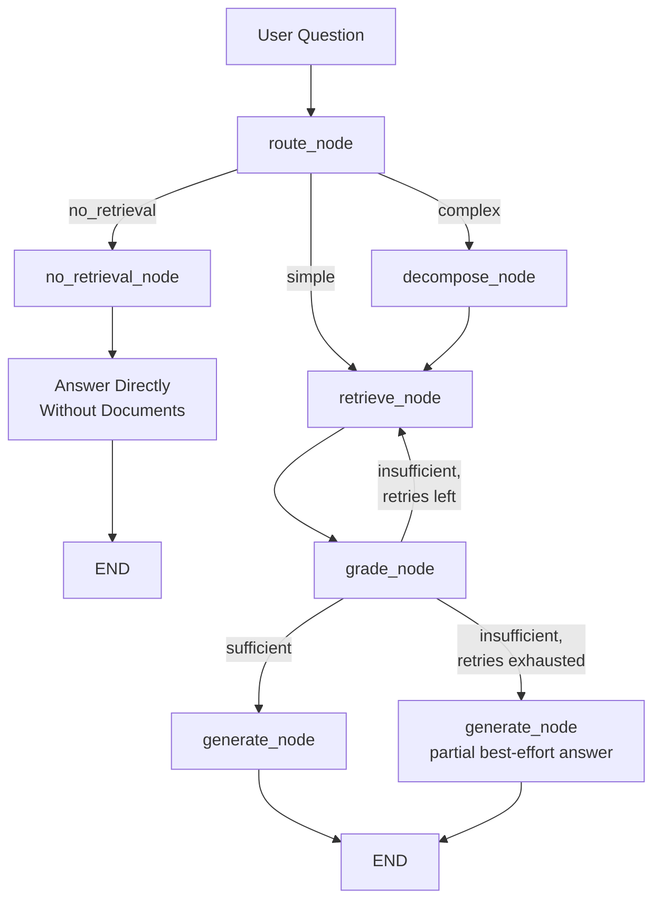

# Agentic RAG System

This repository contains an agentic RAG system built on the frameworks that
dominate 2026 production RAG: **LlamaIndex** for ingestion/indexing/retrieval, **LangChain** for LLM wrapping and prompt composition,
**LangGraph** for the agentic orchestration graph.
The agentic design routes each query:

- **no_retrieval** → answered directly by the LLM, no documents.
- **simple** → retrieve → grade → generate. A failed grade re-retrieves up
  to `MAX_RETRIES` times, then falls back to a partial best-effort answer.
- **complex** → decompose → retrieve → grade → generate. Same grading gate:
  each sub-question is retrieved and graded, and a failed grade re-retrieves
  (re-targeting every sub-question with a wider budget) up to `MAX_RETRIES`
  times, then falls back to a partial best-effort answer.

Both simple and complex routes share the identical `grade` exit: go to
`generate` when the context is sufficient **or** `retry_count` has reached
`MAX_RETRIES`, otherwise loop back to `retrieve`. The only difference is that
the complex route threads a `decompose` step first and grades each
sub-question independently (a multi-part question is only "sufficient" when
every sub-question is covered).

The used dataset is the GutenQA dataset. You can download the three required
files ('GutenQA.parquet', 'gutenqa_chunks.parquet', 'questions.parquet') from
the HuggingFace repository and insert them into the data folder.

## Architecture




## Setup

The pipeline can run on either **embedded-local Qdrant** (no Docker) or a
**remote Qdrant server** (Docker). The default is embedded local; set
`QDRANT_URL` in `.env` to a server address to opt into remote mode
(recommended for corpora larger than ~20,000 chunks). Both modes share the
same index layout and the `rag_system` collection name. Start with the CLI
demo, then optionally switch to the API service.

#### Option A — CLI demo (embedded Qdrant, no Docker)

```bash
python -m venv .venv && source .venv/bin/activate
pip install -e .
python -m scripts.ask {query}       # Example:  python -m scripts.ask "In 1872, at what number and street did Phileas Fogg live in London?"
```

#### Option B — API service (Docker Qdrant)

1. **Start the vector database.** Docker Desktop must show "Engine running"
   (`docker info` must succeed), then:

   ```bash
   docker compose up -d        # Qdrant on :6333 (dashboard: localhost:6333/dashboard)
   ```

2. **Point the pipeline at the remote server** in `.env`:

   ```dotenv
   QDRANT_URL=http://localhost:6333
   QDRANT_COLLECTION=rag_system
   ```

   `QDRANT_API_KEY` is optional and only needed for authenticated servers.

3. **Install dependencies and serve the API:**

   ```bash
   python -m venv .venv && source .venv/bin/activate
   pip install -e .
   python -m uvicorn src.api.main:app                 # localhost:8000
   # LAN access:  python -m uvicorn src.api.main:app --host 0.0.0.0
   ```

4. **Check it and query it** with **curl** (Linux/macOS):

   ```bash
    question="In 1872, at what number and street did Phileas Fogg live in London?"
    
    curl -s http://localhost:8000/query \
      -H "Content-Type: application/json" \
      -d "$(jq -n --arg question "$question" '{question: $question}')" \
      | jq
   ```

   Or with **PowerShell** (Windows):

   ```powershell
   # Ensure UTF-8 input/output on Windows PowerShell 5.1
   [Console]::OutputEncoding = [System.Text.Encoding]::UTF8

   $question = "In 1872, at what number and street did Phileas Fogg live in London?"
   $body = @{ question = $question } | ConvertTo-Json
   $r = Invoke-RestMethod -Uri "http://localhost:8000/query" -Method Post `
     -ContentType "application/json; charset=utf-8" -Body $body

   "ROUTE: $($r.route)"
   "`nANSWER:"
   $r.answer
   "`nSOURCES:"
   for ($i = 0; $i -lt $r.sources.Count; $i++) {
     "`n[$($i + 1)] $($r.sources[$i].source)"
     $r.sources[$i].text
   }
   ```

5. **Notes**
   - The **first query** lazily creates and fills the remote `rag_system`
     collection (36,917 chunks), reusing the on-disk embedding cache so no
     re-embedding is required; later queries are fast.
   - Optional warm-up: run `python -m scripts.ask "..."` once with the same
     `.env` — the CLI and the API then share that same remote index.
   - The CLI (`scripts.ask`) prints each graph node as it runs; the API
     exposes the same graph as JSON (`POST /query` → `{answer, route, sources}`).

## Reproducibility

The LLM client is deterministic by default: `GROQ_TEMPERATURE=0.0` with a
fixed `GROQ_SEED=42` (`groq_temperature` / `groq_seed` in `Settings`). This
keeps routing, grading, and generation stable across runs and environments.
Groq's `seed` support is best-effort, so results may still vary slightly
across Groq infrastructure. Adjust these values in `.env` if you want
temperature sampling back.

## Evaluation

Uses [RAGAS](https://docs.ragas.io/) to score the pipeline on the GutenQA
dataset with four metrics:

- **faithfulness** — is the answer grounded in the retrieved context?
- **answer_relevancy** — is the answer relevant to the question?
- **context_precision** — do retrieved chunks contain relevant information?
- **context_recall** — did retrieval surface all relevant chunks?

A dedicated judge LLM (separate from the generation model) scores the answers
so results are not biased by the production prompt.

```bash
python -m venv .venv && source .venv/bin/activate
pip install -e .
python -m src.evaluation.run_eval                 # full run
python -m src.evaluation.run_eval --limit 25       # quick smoke test
python -m src.evaluation.run_eval --max-workers 8  # parallelise
```

The script prints aggregate scores and a per-route breakdown
(`no_retrieval` / `simple` / `complex`), which shows how each routed path
performs independently.